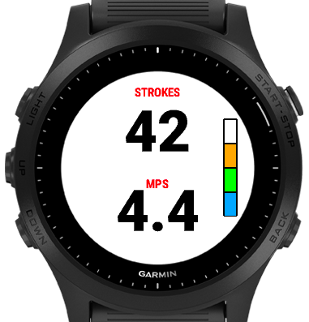

# Build Vaaka Data Field with ConnectIQ SDK

The data field uses ANT to communicate with the Vaaka device.  

To build and modify the data field, an ANT USB dongle is needed to access the Vaaka device via the ANT in the ConnectIQ Simulator. 

To build the data field:

1. Download and install the [ConnectIQ SDK](https://developer.garmin.com/connect-iq/sdk/) and Visual Studio Code SDK Extension.
2. Clone the Data Field - 
```
git clone https://github.com/drffej/vaakafields.git
```
3. Open the `vaakafields` folder in VS Code.
4. In VS Code regenerate a new manifest id:
    - Use Ctrl + Shift + P (Command + Shift + P on the Mac) to summon the command palette
    - Type “UUID” and select "Monkey C: Regenerated UUID"
5. Select *Run > Run Without Debugging* (Command + F5 on Mac, Ctrl + F5 on other platforms)
   You will be prompted with the list of products your application supports. Select one from the list.

If all goes well the simulator will start up and the selected watch will appear:



