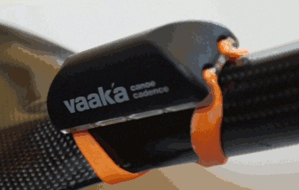

# Vaaka Cadence and Meters per Stroke Fields

Garmin ConnectIQ data field to display paddle cadence and meters per stroke information from a [Vaaka Cadence Device](https://www.vaakacadence.com/). 

Features:

- Displays paddle cadence and meters per stroke information
- Displays paddle intensity gauge using recommended intensity ranges for *Endurance*, *Tempo*, *Threshold* and *VO2 max*
- Allows paddle cadence data to be recorded for any activity e.g. kayaking type via direct ANT connection to the Vaaka Cadence device
- Paddle Cadence and Meters per Stroke data are automatically uploaded to Garmin Connect site for session analysis
- Paddle session come up as kayakimg on Strava and are not mixed up with Cycling.

## Paddle Gauge Cadence ranges

The data field has been set to use the following paddle cadence ranges:

Intensity | Name | Cadence (double strokes per minute)|Gauge Colour
:---|:---|:---|:---
1|Recovery|28-32|Dark Gray
2|Endurance|32-36|Blue
3|Tempo|36-38|Orange
4|V02 Max|44+|Red

These can be changed via the app setting feature on the Connect IQ app.  See [changing app settings](https://forums.garmin.com/developer/connect-iq/w/wiki/14/changing-your-app-settings-in-garmin-express-gcm-ciq-mobile-store?_ga=2.75208401.279501722.1676368629-592074247.1673710446) on the Garmin forums site for more information.

## Session analysis

The paddle cadance and distance per stoke information for an activity can be viewed via the [Garmin Connect](https://connect.garmin.com) site.  
These can be combined with other session data such as heart-rate and speed for analysis of quality of training and paddle consistency.

The graph below paddle cadence and meters per stroke graphs, for an activity, as shown on Garmin Connect site:

The graph below shows paddle cadance (grey) plotted against boat speed (blue) and meters per stoke (green):

## Installation

Install the field from the [ConnnectIQ](https://apps.garmin.com/en-US/apps/1b64207a-020f-45cc-8bf4-94e75f47d3b9) app store.

These can be changed via the Connect IQ application setting - see [link](https://forums.garmin.com/developer/connect-iq/w/wiki/14/changing-your-app-settings-in-garmin-express-gcm-ciq-mobile-store?_ga=2.139361142.417454056.1673869694-592074247.1673710446).

## Feedback

Please either raise an issue if anything doesn't work correctly, or if you use an unsupported Garmin device, via the [Github issues page](https://github.com/drffej/vaakafields/issues) or via the [Garmin app store](https://apps.garmin.com/en-US/apps/1b64207a-020f-45cc-8bf4-94e75f47d3b9).

Please [leave a review](https://apps.garmin.com/en-US/apps/1b64207a-020f-45cc-8bf4-94e75f47d3b9) if you like the data field.
